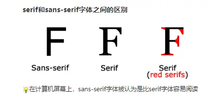

# Fonts(字体)

> CSS字体属性定义字体，加粗，大小，文字样式



| 值             | 描述                                                         | 值&描述                                                      |
| :------------- | :----------------------------------------------------------- | ------------------------------------------------------------ |
| *font-style*   | 规定字体样式。                                               | normal\|italic(斜体)\|bolique(倾斜)\|inherit                 |
| *font-variant* | 规定字体异体。                                               | normal\|small-caps(显示小心大写字母的字体)\|inherit          |
| *font-weight*  | 规定字体粗细                                                 | normal\|bold(粗体)\|bolder(更粗的字符)\|lighter(更细的字符)\|100(数字)\|inherit |
| *font-size*    | 字体尺寸和行高                                               | xx-small \| x-small \| small \| medium(默认) \| large \| x-large \| xx-large\| smaller(比父元素更小的尺寸) \| larger(比父元素更大的尺寸) \| length(固定值) \| %(为父元素的一个百分值) \| inherit \| |
| *line-height*  | 行高                                                         |                                                              |
| *font-family*  | 规定字体系列。参阅：[font-family](https://www.w3cschool.cn/cssref/pr-font-font-family.html) 中可能的值。 |                                                              |
| caption        | 定义被标题控件（比如按钮、下拉列表等）使用的字体。           |                                                              |
| icon           | 定义被图标标记使用的字体。                                   |                                                              |
| menu           | 定义被下拉列表使用的字体。                                   |                                                              |
| message-box    | 定义被对话框使用的字体。                                     |                                                              |
| small-caption  | caption 字体的小型版本。                                     |                                                              |
| status-bar     | **定义被窗口状态栏使用的字体**                               |                                                              |

## @font-face

> 可以使用自己喜欢的任意字体

```css
@font-face {
  font-family: myFirstFont;
  src: url('Sansation_Light.ttf'), url('Sansation_Light.eot'); /* IE9+ */
  font-weight: bold; //可选
}

div {
  font-family: myFirstFont;
}
```

| 描述符        | 值                                                                                                                                      | 描述                                                         |
| :------------ | :-------------------------------------------------------------------------------------------------------------------------------------- | :----------------------------------------------------------- |
| font-family   | *name*                                                                                                                                  | 必需。规定字体的名称。                                       |
| src           | *URL*                                                                                                                                   | 必需。定义字体文件的 URL。                                   |
| font-stretch  | normal \| condensed \| ultra-condensed\|extra-condensed \| semi-condensed expanded \| semi-expanded \| extra-expanded \| ultra-expanded | 可选。定义如何拉伸字体。默认是 "normal"。                    |
| font-style    | ormal italic oblique                                                                                                                    | 可选。定义字体的样式。默认是 "normal"。                      |
| font-weight   | normal bold 100...                                                                                                                      | 可选。定义字体的粗细。默认是 "normal"。                      |
| unicode-range | *unicode-range*                                                                                                                         | 可选。定义字体支持的 UNICODE 字符范围。默认是 "U+0-10FFFF"。 |
