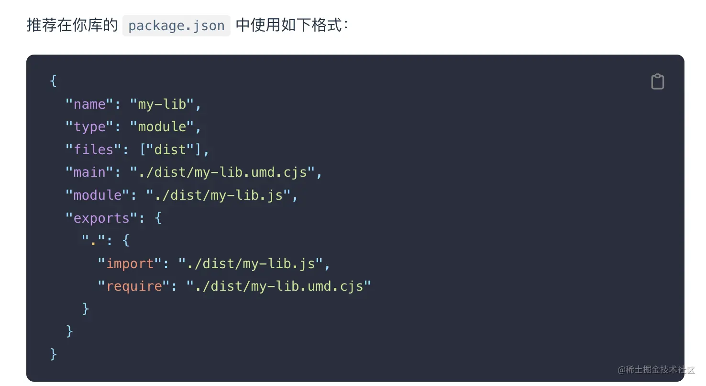

# 入口文件

```json
{
  "main": "./index.js",
  "browser": "./browser/index.js",
  "module": "./index.mjs"
}
```

## main

- 项目发布时，默认会包括 `package.json`，`license`，`README` 和`main` 字段里指定的文件，因为 main 字段里- 指定的是项目的入口文件，在 browser 和 Node 环境中都可以使用
- 如果不设置 main 字段，那么入口文件就是根目录下的 `index.js`

- 比如 packageA 的 main 字段指定为 `index.js`

```json
{
  "main": "./index.js"
}
```

> 引入 packageA 时，实际上引入的就是 node_modules/packageA/index.js。
> 这是早期只有 CommonJS 模块规范时，指定项目入口的唯一属性。

## browser

> - `main` 字段里指定的入口文件在 browser 和 Node 环境中都可以使用
> - 如果只想在 web 端使用，不允许在 server 端使用，可以通过 browser 字段指定入口

```json
{
  "browser": "./browser/index.js"
}
```

## module

> 同样，项目也可以指定 ES 模块的入口文件，这就是 module 字段的作用

```json
{
  "module": "./index.mjs"
}
```

## webpack 构建项目

比如 `webpack` 构建项目时默认的 `target` 为 `web`，也就是 `Web` 构建。它的 `resolve.mainFeilds` 字段默认为 `['browser', 'module', 'main']`

```js
module.exports = {
  resolve: {
    // 此时会按照 browser -> module -> main 的顺序来查找入口文件。
    mainFields: ['browser', 'module', 'main'],
  },
}
```

## exports

> node 在 14.13 支持在 package.json 里定义 exports 字段，拥有了条件导出的功能。
> exports 字段可以配置不同环境对应的模块入口文件，并且当它存在时，它的优先级最高。

比如使用 require 和 import 字段根据模块规范分别定义入口：

```json
{
  "exports": {
    "require": "./index.js",
    "import": "./index.mjs"
  }
}
```

> 这样的配置在使用 import 'xxx' 和 require('xxx') 时会从不同的入口引入文件，exports 也支持使用 browser 和 node 字段定义 browser 和 Node 环境中的入口。
> 上方的写法其实等同于：

```json
{
  "exports": {
    ".": {
      "require": "./index.js",
      "import": "./index.mjs"
    }
  }
}
```

为什么要加一个层级，把 require 和 import 放在 "." 下面呢？
因为 exports 除了支持配置包的默认导出，还支持配置包的子路径。
比如一些第三方 UI 包需要引入对应的样式文件才能正常使用。
`import packageA/dist/css/index.css`;

我们可以使用 exports 来封装文件路径：

```json
{
 "exports": {
   "./style": "./dist/css/index.css'
 }
}
```

用户引入时只需：

`import packageA/style;`

除了对导出的文件路径进行封装，exports 还限制了使用者不可以访问未在 "exports" 中定义的任何其他路径。

- 比如发布的 `dist` 文件里有一些内部模块 `dist/internal/module` ，被用户单独引入使用的话可能会导致主模块不可用。为了限制外部的使用，我们可以不在 exports 定义这些模块的路径，这样外部引入 packageA/`dist/internal/module` 模块的话就会报错
  结合上面入口文件配置的知识，再来看看下方 vite 官网推荐的第三方库入口文件的定义


