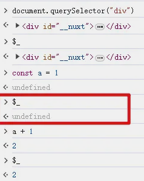
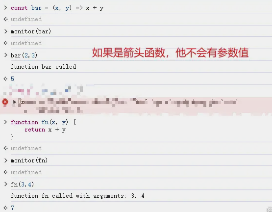
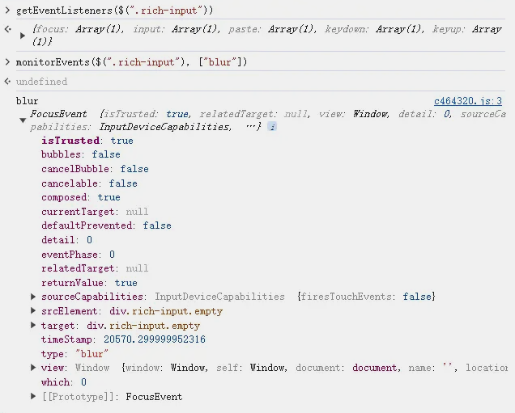
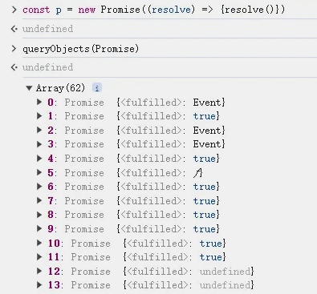

# [`控制台Api`](https://developer.chrome.com/docs/devtools?hl=zh-cn)

## `$0-4`

- `$0`最常用，返回当前选中的dom元素。因为我从事的工作原因，经常会使用到它
- `$1-4`分别表示最近选中的元素。例如$1表示上次选中的元素，以此类推

## `$_`

- 返回终端中上一次计算的表达式的值

## `$(selector, parentNode?)`

- `$(selector, parentNode?)` 是 `document.querySelector()` 的快捷方式。还支持参数二，表示从哪个节点下查找,默认值document。

## `$$(selector, parentNode?)`

- `$$(selector, parentNode)` 等价于`Array.from(document.querySelectorAll())`。注意他返回的是一个数组，而不是一个类数组，因此我们可以直接调用数据api, 用法同`$(selector, parentNode?)`

## `copy(target)`

- 将指定对象的字符串表示形式复制到剪贴板。将控制台变量复制到剪贴板让我们使用

## `inspect(dom/fn)`

- 定位到dom元素（Elements）和控制台中的js函数（在Sources中打开展示）

## `getEventListeners(dom)`

- 返回在指定对象上注册的事件监听器。返回值是一个对象，其中包含每个已注册事件类型（例如 click 或 keydown）的数组。每个数组的成员都是对象，用于描述为每个类型注册的监听器。就是elements面板中的Event Listenerstab。 如果你需要分析网站交互，这个就可以快速找到绑定的事件，很方便。

## `monitor(function)`

- 调用指定的函数时，控制台会记录一条消息，指明函数名称以及调用时传递给该函数的参数。使用 unmonitor(function) 可停止监控

## `monitorEvents(dom [, events])`

- 当指定dom对象上发生其中一个指定事件时，该 Event 对象会记录到控制台中。您可以指定要监控的单个事件、事件数组或映射到预定义事件集合的某种通用事件“类型”。使用 `unmonitorEvents(dom [, events])` 可停止监控
- 可以先使用getEventListeners(dom)去查看当前dom绑定了哪些事件，然后在进行特定事件监听，不然输出内容很多
  

## `queryObjects(Constructor)`

- 以数组形式返回使用指定构造函数创建的对象。查找范围为当前选择的执行上下文

## 简写

- `keys(object)` => `Object.keys(object)`
- `values(object)` => `Object.values(object)`
