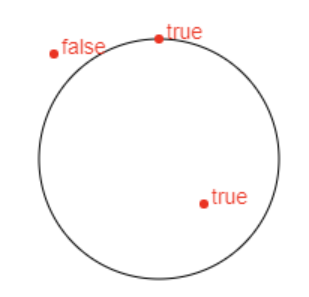

# isPointInPath

> `CanvasRenderingContext2D.isPointInPath()`用来检测某个点是否在当前路径中

```js
context.isPointInPath(x, y)
context.isPointInPath(x, y, fillRule)
// 下面语法IE不支持
context.isPointInPath(path, x, y)
context.isPointInPath(path, x, y, fillRule)
```

> 此方法返回Boolean值。

| 参数                | 作用                                                                                                                       |
| ------------------- | -------------------------------------------------------------------------------------------------------------------------- |
| `x {Number}`        | 用来检测的点的横坐标                                                                                                       |
| `y {Number}`        | 用来检测的点的纵坐标                                                                                                       |
| `fillRule {String}` | 填充规则。用来确定一个点实在路径内还是路径外。<br/>可选值包括：<br> `nonzero`：非零规则(default)<br> `evenodd`：奇偶规则。 |
| `path { Object }`   | 指Path2D对象。                                                                                                             |

```js
// 画一个圆
context.arc(120, 120, 80, 0, Math.PI * 2)
context.stroke()
// 用来测试的点坐标们
var arrPoints = [
  {
    x: 50,
    y: 50,
  },
  (point2 = {
    x: 150,
    y: 150,
  }),
  (point3 = {
    x: 120,
    y: 40,
  }),
]
arrPoints.forEach(function (point) {
  // 检测点是否在路径内
  point.isPointInPath = context.isPointInPath(point.x, point.y)
})
arrPoints.forEach(function (point) {
  // 标记这几个点
  context.fillStyle = 'red'
  context.beginPath()
  context.arc(point.x, point.y, 3, 0, Math.PI * 2)
  context.fill()
  // 检测结果以文本方式绘制
  context.font = '14px arial'
  context.fillText(point.isPointInPath, point.x + 5, point.y)
})
```



> 在路径范围内和正好压在路径上，返回值都是true，在路径外返回值是false
