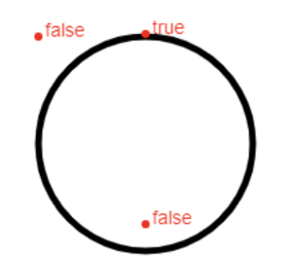

# isPointInStroke

> 检测是否在描边上

```js
context.isPointInStroke(x, y)
context.isPointInStroke(path, x, y)
```

> 此方法返回Boolean值。

| 参数   | 类型     | 作用                 |
| :----- | :------- | :------------------- |
| `x`    | `Number` | 用来检测的点的横坐标 |
| `y`    | `Number` | 用来检测的点的纵坐标 |
| `path` | `Object` | 指Path2D对象         |

```js
// 画一个圆
context.arc(120, 120, 80, 0, Math.PI * 2)
context.lineWidth = 5
context.stroke()
// 用来测试的点坐标们
var arrPoints = [
  {
    x: 40,
    y: 40,
  },
  (point2 = {
    x: 120,
    y: 180,
  }),
  (point3 = {
    x: 120,
    y: 38,
  }),
]
arrPoints.forEach(function (point) {
  // 检测点是否在路径内
  point.isPointInStroke = context.isPointInStroke(point.x, point.y)
})
arrPoints.forEach(function (point) {
  // 标记这几个点
  context.fillStyle = 'red'
  context.beginPath()
  context.arc(point.x, point.y, 3, 0, Math.PI * 2)
  context.fill()
  // 检测结果以文本方式绘制
  context.font = '14px arial'
  context.fillText(point.isPointInStroke, point.x + 5, point.y)
})
```



> 只有检测点在描边路径上，才返回true，在描边路径外和描边路径内部都返回false
