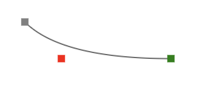

# 曲线

## 一次贝塞尔曲线

> - 没有控制点
> - 就是一条直线

## 二次贝塞尔曲线 quadraticCurveTo

> - 一个控制点

```js
quadraticCurveTo(cpx, cpy, x, y) // (cp1x,cp1y) 控制点    (x,y)结束点
```

| 参数  | 类型     | 作用           |
| :---- | :------- | :------------- |
| `cpx` | `Number` | 控制点的横坐标 |
| `cpy` | `Number` | 控制点的纵坐标 |
| `x`   | `Number` | 结束点的横坐标 |
| `y`   | `Number` | 结束点的纵坐标 |

```js
// 开始绘制
context.beginPath()
context.moveTo(50, 50)
context.quadraticCurveTo(100, 100, 250, 100)
context.stroke()
```



## 三次贝塞尔曲线 bezierCurveTo

> - 两个控制点
> - 绘制: 正圆, 椭圆, 曲线图像
>   `context.bezierCurveTo( cp1x, cp1y ,cp2x , cp2y ,x , y )` > `( cp1x, cp1y)`: 控制点1
>   `( cp2x, cp2y)`: 控制点2  
>   `( x, y)`: 结束点

```js
context.beginPath()
context.moveTo(50, 50)
context.bezierCurveTo(100, 100, 200, 40, 250, 100)
context.stroke()
```


> 灰色是起始点，红色是两个控制点
> 其中有1个白点的是第1个控制点，有2个白点的是第2个控制点，绿色是结束点
