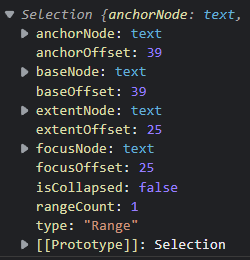

# getSelection

> 用户选择范围或光标的当前位置

- 与 `Document.getSelection()` 等价
- 值得注意的是，目前在 Firefox, Edge (非 Chromium 版本) 及 Internet Explorer 中，`getSelection()` 对 `<textarea>`及 `<input>` 元素不起作用。 `HTMLInputElement.setSelectionRange()` 或 `selectionStart` 及 `selectionEnd` 属性可用于解决此问题

- 还要注意选择不同于焦点（详见 Selection 及输入焦点）。可使用`Document.activeElement` 来返回当前的焦点元素

```js
let selObj = window.getSelection()
console.log(selObj)
let selRange = selObj.getRangeAt(0)
```



## 术语

- 锚点（anchor）

> 锚指的是一个选区的起始点。当我们使用鼠标选择一个区域的时候，锚点就是我们鼠标按下瞬间的那个点。在用户拖动鼠标时，锚点是不会变的。

- 焦点（focus）
  选区的焦点是该选区的终点，当您用鼠标框选一个选区的时候，焦点是你的鼠标松开瞬间所记录的那个点。随着用户拖动鼠标，焦点的位置会随着改变。

- 范围（range）
  范围指的是文档中连续的一部分。一个范围包括整个节点，也可以包含节点的一部分，例如文本节点的一部分。用户通常下只能选择一个范围。“范围”会被作为range对象返回。Range对象也能通过DOM创建、增加、删减。

## 属性

- `anchorNode`: 返回该选区起点所在的节点

- `anchorOffset`:
  - 返回一个数字，表示该选区起点在anchorNode中的位置偏移量
  - 如果 anchorNode 是文字节点，那么返回的就是从该文字节点的第一个字开始，直到被选中的第一个字之间的字数（如果第一个字就被选中，那么偏移量为零）
  - 如果 anchorNode 是一个元素，那么返回的就是在选区第一个节点之前的同级节点总数。(这些节点都是 anchorNode 的子节点)
- `focusNode`: 返回该选区终点所在的节点

- `focusOffset`:

  - 返回一个数字，表示该选区终点在focusNode中的位置偏移量
  - 如果 focusNode 是文字节点，那么选区末尾未被选中的第一个字，在该文字节点中是第几个字（从0开始计），就返回它。
  - 如果 focusNode 是一个元素，那么返回的就是在选区末尾之后第一个节点之前的同级节点总数

- `isCollapsed`: 返回一个布尔值，用于判断选区的起始点和终点是否在同一位置

- `rangeCount`: 返回一个数字，表示该选区所包含的连续范围的数量。一般为1，因为通常情况下用户只能选择一个范围

## 方法

- `getRangeAt`:

  - 返回选区开始的节点（Node）
  - 因为通常情况下用户只能选择一个范围，所以只有一个选区（range），此方法一般为getRangeAt(0)

- `collapse`(光标落在的目标节点, offset): 将当前的选区折叠为一个点

- `extend`: 将选区的焦点移动到一个特定的位置。

- `modify`: 修改当前的选区

- `collapseToStart`: 将当前的选区折叠到起始点

- `collapseToEnd`: 将当前的选区折叠到最末尾的一个点

- `selectAllChildren`: 将某一指定节点的子节点框入选区

- `addRange`: 一个区域（Range）对象将被加入选区

- `removeRange`: 从选区中移除一个区域

- `removeAllRanges`: 将所有的区域都从选区中移除

- `deleteFromDocument`: 从页面中删除选区中的内容

- `selectionLanguageChange`: 当键盘的朝向发生改变后修改指针的Bidi优先级

- `toString`: 返回当前选区的纯文本内容

- `containsNode`: 判断某一个node是否为当前选区的一部分

## 拓展

### 替换选中

- 待测试

```js
//替换选中文本内容，参数text为要替换的内容
function repaceSelectionText(text) {
  //非IE浏览器
  if (window.getSelection) {
    var sel = window.getSelection()
    alert(sel.rangeCount) //选区个数, 通常为 1 .
    sel.deleteFromDocument() //清除选择的内容
    var r = sel.getRangeAt(0) //即使已经执行了deleteFromDocument(), 这个函数仍然返回一个有效对象.
    var selFrag = r.cloneContents() //克隆选择的内容
    var frag = selFrag.childNodes //如果执行了deleteFromDocument(), 这个数组长度将会是 0
    for (var i = 0; i < frag.length; i++) {
      alert(frag[i].nodeName) //枚举选择的对象
    }
    var h1 = document.createElement('H1') //生成一个插入对象
    h1.innerHTML = text //设置这个对象的内容
    r.insertNode(h1) //把对象插入到选区, 这个操作不会替换选择的内容, 而是追加到选区的后面, 所以如果需要普通粘贴的替换效果, 之前执行deleteFromDocument()函数.
  } else if (document.selection && document.selection.createRange) {
    //IE浏览器
    var sel = document.selection.createRange() //获得选区对象
    alert(sel.htmlText) //选择区的html文本.
    sel.pasteHTML('<h1>标题</h1>') //粘贴到选区的html内容, 会替换选择的内容.
  }
}
```

### 插入文字

- 待测试

```js
function insertSelectionText(html) {
  if (document.selection && document.selection.createRange) {
    /****这里需要解决IE丢失光标位置的问题，详见核心代码四**************/
    document.selection.createRange().pasteHTML(html)
  } else {
    var selection = document.getSelection()
    var range
    if (selection) {
      range = selection.getRangeAt(0)
    } else {
      range = iframeDocument.createRange()
    }
    var oFragment = range.createContextualFragment(html),
      oLastNode = oFragment.lastChild
    range.insertNode(oFragment)
    range.setEndAfter(oLastNode)
    range.setStartAfter(oLastNode)
    selection.removeAllRanges() //清除选择
    selection.addRange(range)
  }
}
```
