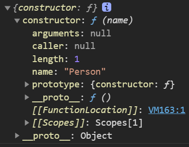

# 原型链

> - 对象集成属性的一个链条
> - 原型对象默认的==constructor==属性指向构造函数


```js
var Person = function (name) { this.name = name; } //person是构造函数
var o3 = new Person('personTwo' )// o3 是实例

o3 // Persion{name:"persionTwo"}
Person // f(name){this.name = name; }
```



## 实例化方法

### 字面量

```js
let obj = { name : 'grh'}
```

### Object 构造函数 创建

```js
let obj = new Object();
obj.name = 'grh';
```

### 工厂模式创建对象

```js
function createPerson(name){
 letr o = new Object();
 o.name = name;
 return o; 
}
let person1 = createPerson('grh');
```

### 使用构造函数创建对象

```js
function Person(name){
  this.name = name;
}
let person = new Person('grh')
```

## new 运算符

> 1. 创建一个新的对象
> 2. ==this==指向构造函数
> 3. 构造函数有返回, 会替代new出来的对象,  如果没有就是new出来的对象
> 4. 手动封装一个new运算符

## 对象的原型链


## 继承方式

### 原型链继承

> - 将父类的实例封装作为子类的原型
> - 优缺点
>   - 简单易于实现
>   - 想为子类新增属性和方法, 必须要在`new Animal()`之后

```js
// 定义一个动物类
function Animal (name) {
  // 属性
  this.name = name || 'Animal';
  // 实例方法
  this.sleep = function(){
    console.log(this.name + '正在睡觉！');
  }
}
// 原型方法
Animal.prototype.eat = function(food) {
  console.log(this.name + '正在吃：' + food);
};

// 子类
function Cat(){}
Cat.prototype = new Animal();
Cat.prototype.name = 'cat';

//　Test Code
var cat = new Cat();
console.log(cat.name);//cat
console.log(cat.eat('fish'));//cat正在吃：fish  undefined
console.log(cat.sleep());//cat正在睡觉！ undefined
console.log(cat instanceof Animal); //true 
console.log(cat instanceof Cat); //true
```

### 构造继承

> - 利用call来改变Cat中的this指向
> - 优缺点
>   - 可以实现多继承
>   - 不能继承原型属性 / 方法

```js
function Cat(name){
  Animal.call(this);
  this.name = name || '';
}
```

### 实例继承

> - 为父类实例添加新特性, 作为子类实例返回
> - 优缺点
>   - 不限制调用方法, 但不能实现多继承

```js
function Cat(name){
  let instance = new Animal();
  instance.name = name || "";
  return instance;
}
```

### 拷贝继承

> - 将父类属性和方法拷贝一份到子类中
> - 优缺点
>   - 支持多继承
>   - 效率低, 占用内存

```js
function Cat(name){
  var animal = new Animal();
  for(var p in animal){
    Cat.prototype[p] = animal[p];
  }
  Cat.prototype.name = name || 'Tom';
}
```

### 组合继承

> - 通过调用父类构造，继承父类的属性并保留传参的优点，然后通过将父类实例作为子类原型，实现函数复用

```js
function Cat(name){
  Animal.call(this);
  this.name = name || 'Tom';
}
Cat.prototype = new Animal();
Cat.prototype.constructor = Cat;
```

### 寄生组合继承

```js
function Cat(name){
  Animal.call(this);
  this.name = name || 'Tom';
}
(function(){
  // 创建一个没有实例方法的类
  var Super = function(){};
  Super.prototype = Animal.prototype;
  //将实例作为子类的原型
  Cat.prototype = new Super();
})();
```

### ES6 extend 继承

> - ES6 的继承机制是先创造父类的实例对象this（所以必须先调用super方法），然后再用子类的构造函数修改this

```js
//父类
class Person {
    //constructor是构造方法
    constructor(skin, language) {
        this.skin = skin;
        this.language = language;
    }
    say() {
        console.log('我是父类')
    }
}

//子类
class Chinese extends Person {
    constructor(skin, language, positon) {
        //console.log(this);//报错
        super(skin, language);
        //super();相当于父类的构造函数
        //console.log(this);调用super后得到了this，不报错，this指向子类，相当于调用了父类.prototype.constructor.call(this)
        this.positon = positon;
    }
    aboutMe() {
        console.log(`${this.skin} ${this.language}  ${this.positon}`);
    }
}


//调用只能通过new的方法得到实例,再调用里面的方法
let obj = new Chinese('红色', '中文', '香港');
obj.aboutMe();
obj.say();

```
