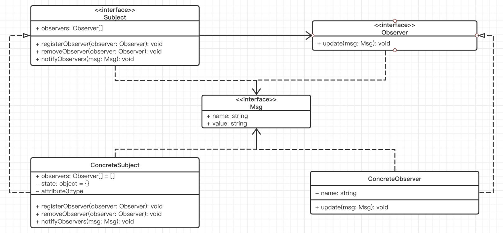
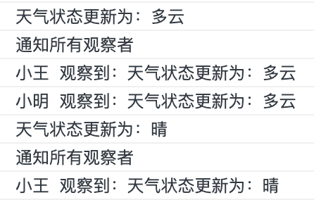

# 观察者模式

> 观察者模式:
>
> - 定义对象间的一种一对多的依赖关系，当一个对象的状态发生改变时，所有依赖于它的对象都得到通知并被自动更新。
> - 就好比我们去点餐,通知服务员说，餐好了跟我说一下。那么服务员和顾客之间就形成了耦合，首先服务员得知道餐品好了以后通知那些顾客，其次，如果是多位服务员协作，每个服务员都需要知道这些顾客。
>
>   但事实上你发现去 kfc 点餐的时候，服务员并没有直接通知我们。而是采用叫号的方式。细想一下，你去 kfc，是不是可以在点餐系统进行排号（网上或者排队，这里抽象一下），餐品好了以后，服务员输入点餐号，点一下完成即可，点餐系统会通知对应的顾客取餐。
>
>   这里你和服务员之间的消息通过点餐系统来传递，你并不需要知道是谁点的完成，服务员也不需要知道这份餐品给谁。完美解耦了消息的发送者和接收者。更好地是，我们在点餐或者叫号的时候其实还可以指定行为，比如说 66 号产品好了以后帮我送到 A1 桌。
>
>   再比如说炒股的时候，我们可以委托挂单，就是当股票到了某一个价格就帮你买入或者卖出，等等，例子很多

## 使用场景

1. 当一个抽象模型有两个方面，其中一个方面依赖于另一方面。将这二者封装在独立的对象中以使它们可以各自独立地改变和复用。
2. 当对一个对象的改变需要同时改变其他对象，而不知道具体有多少对象需要被改变。
3. 当一个对象必须通知其他对象，而它又不能假定其他对象是谁。换言之，不希望这些对象是紧密耦合的。

## 角色

1. 抽象主题（Subject）： 它把所有观察者对象的引用保存到一个聚集里，每个主题都可以有任何数量的观察者。抽象主题提供一个接口，可以增加和删除观察者对象。
2. 具体主题（Concrete Subject）： 将有关状态存入具体观察者对象；在具体主题内部状态改变时，给所有登记过的观察者发出通知。
3. 抽象观察者（Observer）： 为所有的具体观察者定义一个接口，在得到主题通知时更新自己。
4. 具体观察者（Concrete Observer）： 实现抽象观察者角色所要求的更新接口，以便使本身的状态与主题状态协调。

## 实现



```typescript
interface Msg {
  // Msg 可以按照任意约定的接口格式去约束，这里假设是如下类型消息
  name: string
  value: string
}

interface Subject {
  registerObserver(observer: Observer): void
  removeObserver(observer: Observer): void
  notifyObservers(msg: Msg): void
}

interface Observer {
  update(msg: Msg): void
}

class ConcreteSubject implements Subject {
  private observers: Observer[] = []
  private state: object = {}
  registerObserver(observer: Observer): void {
    this.observers.push(observer)
  }
  removeObserver(observer: Observer): void {
    const index = this.observers.findIndex((val) => val === observer)
    if (index > -1) {
      this.observers.splice(index, 1)
    }
  }
  notifyObservers(msg: Msg): void {
    this.observers.forEach((observer) => observer.update(msg))
  }
  setState(name, value): void {
    this.state[name] = value
    console.log(`${name}状态更新为：${value}`)
    console.log('通知所有观察者')
    this.notifyObservers({
      name,
      value,
    })
  }
}

class ConcreteObserver implements Observer {
  name: string
  constructor(name: string) {
    this.name = name
  }
  update(msg: Msg): void {
    console.log(`${this.name} 观察到：${msg.name}状态更新为：${msg.value}`)
  }
}

const concreteSubject = new ConcreteSubject()
const concreteObserver1 = new ConcreteObserver('小王')
const concreteObserver2 = new ConcreteObserver('小明')

concreteSubject.registerObserver(concreteObserver1)
concreteSubject.registerObserver(concreteObserver2)
concreteSubject.setState('天气', '多云')

concreteSubject.removeObserver(concreteObserver2)
concreteSubject.setState('天气', '晴')
```



> 这里的 Msg 其实就是一种约定的消息接口，你甚至可以直接使用 Subject，这样Subject 和 Observer 就是一种双向关系（关联和依赖）。另外，这里的 setState 也只是对变更行为的一种抽象而已，你可以在任何事件或者任何时机通知订阅者进行更新。

## 小结

> 当一个对象密切关注另一个对象的某个状态时，就可以使用观察者模式。
>
> 它解除了主题和具体观察者的耦合，让耦合的双方都依赖于抽象，而不是依赖具体。
>
> 在使用轮询的地方，我们应该先考虑是否可以使用观察者模式。因为主动观察是优于被动轮询的。

# 发布订阅模式

> 发布-订阅是一种消息范式，消息的发布者，不会将消息直接发送给特定的`订阅者`，而是通过消息通道广播出去，然后呢，订阅者通过订阅获取到想要的消息。
>
> - 各个模块相互独立
> - 存在一对多的依赖关系
> - 依赖模块不稳定, 依赖关系部位定
> - 各模块由不同的人员, 团队开发


> - 建立一个`eventEmitter`
> - 先通过用户订阅对应的"内容"
> - `eventEmitter`发布内容

## 缩减版

```js
let eventEmitter = {} // 公众号对象
eventEmitter.list = {} // 缓存列表, 存放 event 及 fn

/* 订阅 */
eventEmitter.on = function (event, fn) {
  ;(this.list[event] || (this.list[event] = [])).push(fn)
  return this
}

/* 发布 */
eventEmitter.emit = function () {
  const _this = this
  let event = [].shift.call(
      arguments,
    ) /* 使用 shift 获取arguments 第一个参数就是对应的 event 值  */,
    fns = [..._this.list[event]]
  if (!fns || fns.length === 0)
    return false /* 如果缓存列表里没有缓存 fn, 就直接返回 false */
  fns.forEach((fn) => {
    // 遍历 event 值对应的缓存列表, 依次执行fn
    fn.apply(_this, arguments)
  })
  return _this
}

/* 用户一 */
function user1(content) {
  console.log('用户1订阅了:', content)
}

/* 用户二 */
function user2(content) {
  console.log('用户2订阅了:', content)
}

// 订阅
eventEmitter.on('article', user1)
eventEmitter.on('article', user2)

// 发布
eventEmitter.emit('article', 'Javascript 发布-订阅模式')
```

## 完整版

> node 中 EventEmitter 就是这样一个典型例子。我们来简单实现一个 EventEmitter。

```javascript
interface HandlerInfo {
    handler: Function;
    once?: boolean;
}
class EventEmitter {
    private events: Map<string, HandlerInfo[]> = new Map();
    on(type: string, handler: Function, once?: boolean) {
        if (!this.events.has(type)) {
            this.events.set(type, []);
        }
        (this.events.get(type) || []).push({
            handler,
            once,
        });
        return () => {
            this.off(type, handler);
        };
    }
    once(type: string, handler: Function) {
        return this.on(type, handler, true);
    }
    emit(type: string, ...args) {
        let i = 0;
        while (i < (this.events.get(type) || []).length) { // 这里每次都从 this.events 去动态读取，方中途被变更
            const handlers: HandlerInfo[] = this.events.get(type) || [];
            const { handler, once } = handlers[i];
            // 如果是一次性的，应该在调用前删除，防止这里会自己触发自己，导致无限循环或者次序错乱
            if (once) {
                handlers.splice(i--, 1);
            }
            i++;
            handler(...args); // 这里 this 就交给传入的 handler 来保证了
        }
    }
    off(type?: string, handler?: Function): void {
        if (!type) return; // 最好不要默认全部清除，不安全
        if (!handler) {
            this.events.set(type, []); // 因为这里是直接赋值清空，所以在 emit 的时候，记得每次都从 events 动态获取
            return;
        }
        this.events.set(type, (this.events.get(type) || []).filter(item => item.handler !== handler));
    }
}

const eventEmitter = new EventEmitter();

class Person {
    public name: string;
    constructor(name: string) {
        this.name = name;
    }
    weatherSubscribe(once?: boolean): Function {
        return eventEmitter.on('weather', (weather) => {
            switch (weather) {
                case '雨':
                    console.log(`${this.name}在家看电影`);
                    break;
                default:
                    console.log(`${this.name}出去玩`);
            }
        }, once);
    }
    weatherNotify(weather) {
        eventEmitter.emit('weather', weather);
    }
}

const xiaoWang = new Person('小王');
const xiaoMing = new Person('小明');
const xiaoZhang = new Person('小张');

xiaoWang.weatherSubscribe(true);
const off = xiaoMing.weatherSubscribe();

xiaoZhang.weatherNotify('雨');
xiaoZhang.weatherNotify('晴');

off();
xiaoZhang.weatherNotify('晴');
```

模式.assets/image-20210724195933611.png>)

发布订阅模式可以说是对观察者模式的进一步抽象。

我们通过消息中心对消息进行统一处理，那么这里通知者和消费者的关系其实被弱化了，它们可以是任意对象，通知者和消费者也可以是同一个对象，这种模式甚至在非对象也可以使用，即我们只关注发布和订阅行为本身，而不关心发布订阅者是谁。
