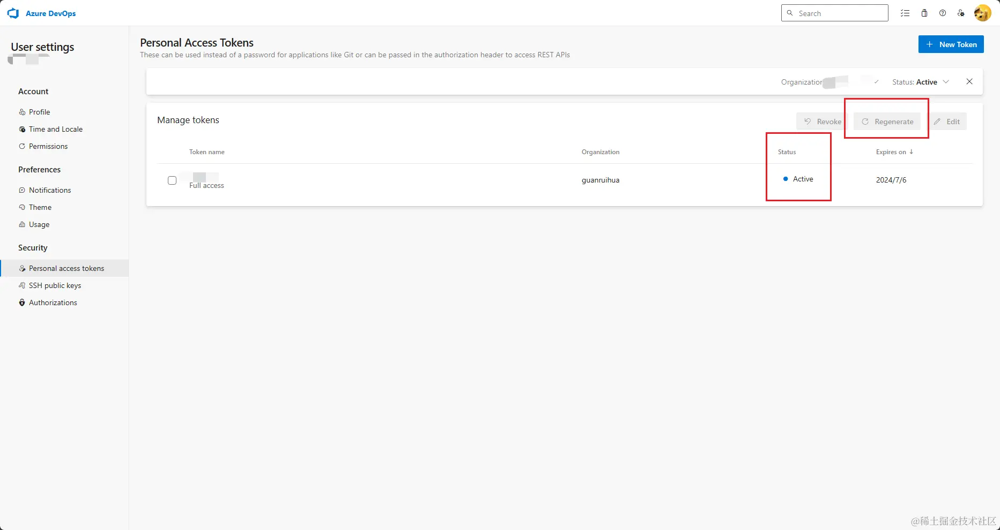

# [`发布失效`](/)

```BASH
vsce publish
```

```BASH
 INFO  Publishing 'ruihuag.ruihuag v0.0.11'...
 ERROR  {"$id":"1","customProperties":{"Descriptor":null,"IdentityDisplayName":null,"Token":null,"RequestedPermissions":0,"NamespaceId":"000000000-0000-0000-0000-000000000000"},"innerException":null,"message":"Access Denied: The Personal Access Token used has expired.","typeName":"Microsoft.VisualStudio.Services.Security.AccessCheckException, Microsoft.VisualStudio.Services.WebApi","typeKey":"AccessCheckException","errorCode":0,"eventId":3000}
```

## 重新生成 token

- dev.azure.com/



- 复制好生成新token
- `vsce login <username>`
- 输入新token
