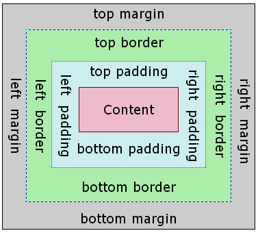
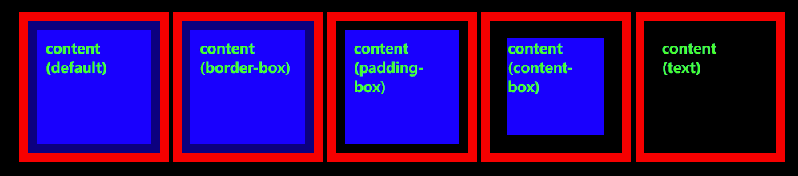

# [`background-clip`](https://developer.mozilla.org/zh-CN/docs/Web/CSS/background-clip)

- 控制背景 图片/ 颜色 填充范围
- 默认: `background`: 会填充盒模型`content` + `padding` + `border`

- `background-clip`: `border-box` | `padding-box` | `content-box` | `text`
  - `border-box` : 填充到`border` (default)
  - `padding-box` : 填充到`padding`
  - `content-box` : 只填充`content`
  - `text` : 只填充`(text)文字`
    - `webkit`需要 使用 `-webkit-background-clip: text`
- [demo](https://ruihuag-demo.github.io/eg/background-clip.html)

