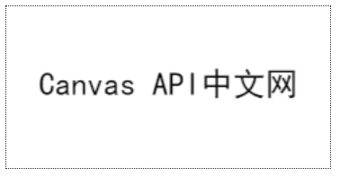
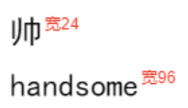

# 文字

## fillText 填充文字

> `CanvasRenderingContext2D.fillText()`: 用来填充文字，是Canvas绘制文本的主力方法
>
> `context.fillText(text, x, y [, maxWidth])` > `text {String}`: 用来填充的文本信息。
> `x {Number}`: 填充文本的起点横坐标。
> `y {Number}`: 填充文本的起点纵坐标。
> `maxWidth（可选）{Number}`: 文本最大宽度(不是换行, 超过该长度会压缩文本宽度)

```js
context.font = '24px STheiti, SimHei'
context.fillText('Canvas API中文网', 24, 66)
```



## measureText 文字宽度

> `CanvasRenderingContext2D.measureText()` 可以用来测量文本的一些数据，返回`TextMetrics`对象，包含字符宽度等信息。

### `context.measureText(text)`

> 返回值是TextMetrics对象
> `text {String}` 被测量的文本

```js
// 设置字体字号
context.font = '24px STHeiTi, SimHei'
// 文本信息对象就有了
var textZh = context.measureText('帅')
var textEn = context.measureText('handsome')
// 文字绘制
context.fillText('帅', 60, 50)
context.fillText('handsome', 60, 90)
// 显示宽度
context.font = '12px Arial'
context.fillStyle = 'red'
context.fillText('宽' + textZh.width, 62 + textZh.width, 40)
context.fillText('宽' + textEn.width, 62 + textEn.width, 80)
```


