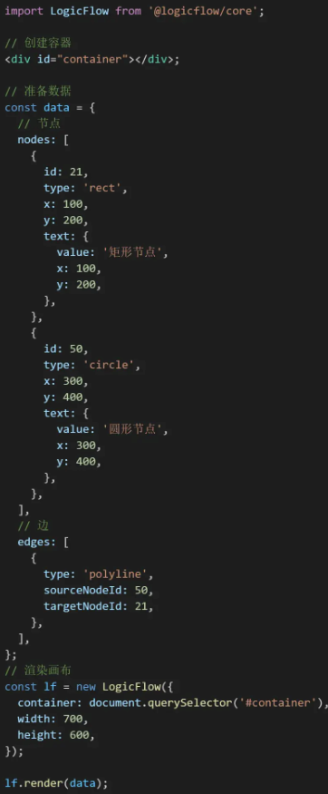

# [`工具库`](/)

## @logicflow/core

- 流程图编辑器框架

## NProgress

- 进度条
- 展示页面加载的进度 / 路由跳转的进度

## tesseract.js

- 识别图片文字

## sharp

- 图像格式转换
- 将常见格式的大型图像转换为较小的、网络友好的JPEG、PNG、WebP、GIF和不同维度的AVIF图像

## Fastify

- 服务器框架
- [介绍](https://zhuanlan.zhihu.com/p/684317580)

## [react-image-crop](https://www.npmjs.com/package/react-image-crop)

- 上传图片剪辑
- [codesandbox(inline preview)](https://codesandbox.io/p/sandbox/react-image-crop-demo-with-react-hooks-y831o?file=%2Fsrc%2FcanvasPreview.ts%3A1%2C28-1%2C44)
- [react-image-crop](https://www.npmjs.com/package/react-image-crop)

## xss

- 防XSS攻击
- <https://www.npmjs.com/package/xss>
