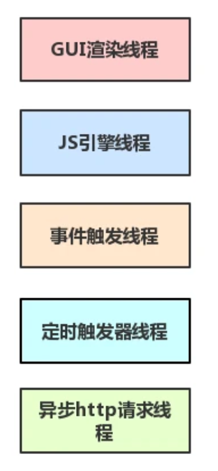

# 浏览器多进程 & JS单进程

[从浏览器多进程到JS单线程，JS运行机制最全面的一次梳理](https://segmentfault.com/a/1190000012925872)

> - 进程是cpu资源分配的最小单位（是能拥有资源和独立运行的最小单位）
> - 线程是cpu调度的最小单位（线程是建立在进程的基础上的一次程序运行单位，一个进程中可以有多个线程）

## 浏览器

> - 浏览器是多进程的
> - 浏览器之所以能够运行，是因为系统给它的进程分配了资源（cpu、内存）
> - 简单点理解，每打开一个Tab页，就相当于创建了一个独立的浏览器进程。

### 浏览器主要进程

> 1. Browser进程：浏览器的主进程（负责协调、主控），只有一个。作用有
>    - 负责浏览器界面显示，与用户交互。如前进，后退等
>    - 负责各个页面的管理，创建和销毁其他进程
>    - 将Renderer进程得到的内存中的Bitmap，绘制到用户界面上
>    - 网络资源的管理，下载等
> 2. 第三方插件进程：每种类型的插件对应一个进程，仅当使用该插件时才创建
> 3. GPU进程：最多一个，用于3D绘制等
> 4. 浏览器渲染进程（浏览器内核）（Renderer进程，内部是多线程的）：默认每个Tab页面一个进程，互不影响。主要作用为
>    - 页面渲染，脚本执行，事件处理等

### 浏览器内核

> 浏览器内核包括

