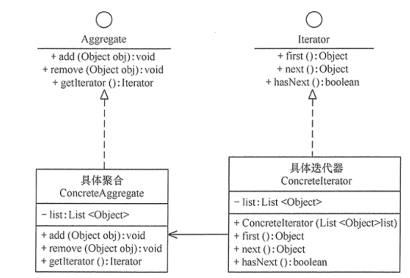

# 迭代器模式

> 迭代器模式(Iterator Pattern): 提供一种方法来访问聚合对象, 而不是暴露这个对象的内部表示, 其名为游标( Cursor )
>
> java中的Collection, list, Set, Map 都包含迭代
>
> 优点:
>
> 1. 访问一个聚合对象的内容而无须暴露它的内部表示。
> 2. 遍历任务交由迭代器完成，这简化了聚合类。
> 3. 它支持以不同方式遍历一个聚合，甚至可以自定义迭代器的子类以支持新的遍历。
> 4. 增加新的聚合类和迭代器类都很方便，无须修改原有代码。
> 5. 封装性良好，为遍历不同的聚合结构提供一个统一的接口。



# Java

```java
public class IteratorPattern {
    public static void main(String[] args) {
        Aggregate ag = new ConcreteAggregate();
        ag.add("中山大学");
        ag.add("华南理工");
        ag.add("韶关学院");
        System.out.print("聚合的内容有：");
        Iterator it = ag.getIterator();
        while (it.hasNext()) {
            Object ob = it.next();
            System.out.print(ob.toString() + "\t");
        }
        Object ob = it.first();
        System.out.println("\nFirst：" + ob.toString());
    }
}

//抽象聚合
interface Aggregate {
    public void add(Object obj);
    public void remove(Object obj);
    public Iterator getIterator();
}

//具体聚合
class ConcreteAggregate implements Aggregate {
    private List<Object> list = new ArrayList<Object>();
    public void add(Object obj) {
        list.add(obj);
    }
    public void remove(Object obj) {
        list.remove(obj);
    }
    public Iterator getIterator() {
        return (new ConcreteIterator(list));
    }
}

//抽象迭代器
interface Iterator {
    Object first();
    Object next();
    boolean hasNext();
}

//具体迭代器
class ConcreteIterator implements Iterator {
    private List<Object> list = null;
    private int index = -1;

    public ConcreteIterator(List<Object> list) {
        this.list = list;
    }

    public boolean hasNext() {
        if (index < list.size() - 1) {
            return true;
        } else {
            return false;
        }
    }

    public Object first() {
        index = 0;
        Object obj = list.get(index);
        ;
        return obj;
    }

    public Object next() {
        Object obj = null;
        if (this.hasNext()) {
            obj = list.get(++index);
        }
        return obj;
    }
}
```

执行结果

```shell
聚合的内容有：中山大学    华南理工    韶关学院
First：中山大学
```

## TS

```typescript
type TObject = Object | undefined | null | string

// 抽象迭代器
interface IIterator {
  first: () => TObject
  next: () => TObject
  hasNext: () => boolean
}

// 具体迭代器
class ConcreteIterator implements IIterator {
  private list: TObject[] = []
  private index: number = -1
  public constructor(list: Array<TObject>) {
    this.list = list
  }
  public first(): TObject {
    return this.list[0]
  }
  public next(): TObject {
    return this.list[++this.index]
  }
  public hasNext(): boolean {
    return this.index < this.list.length - 1
  }
}

// 抽象聚合接口
interface IAggregate {
  add: (obj: TObject) => void
  remove: (obj: TObject) => void
  getIterator: () => IIterator
}

// 抽象聚合类
class Aggregate {
  public add(obj: TObject): void {}
  public remove(obj: TObject): void {}
  public getIterator(): IIterator {
    return new ConcreteIterator(new Array())
  }
}

// 具体聚合
class ConcreteAggregate implements IAggregate {
  private list: TObject[] = []
  public add(obj: TObject): void {
    this.list.push(obj)
  }
  public remove(obj: TObject): void {
    this.list = this.list
      .map((item) => {
        if (item === obj) return
        return item
      })
      .filter((i) => i)
  }
  public getIterator(): IIterator {
    return new ConcreteIterator(this.list)
  }
}

const ag: IAggregate = new ConcreteAggregate()
ag.add('111')
ag.add('222')
ag.add('333')
const it: IIterator = ag.getIterator()
while (it.hasNext()) {
  console.log(it.next())
}

// 输出
111
222
333
```
