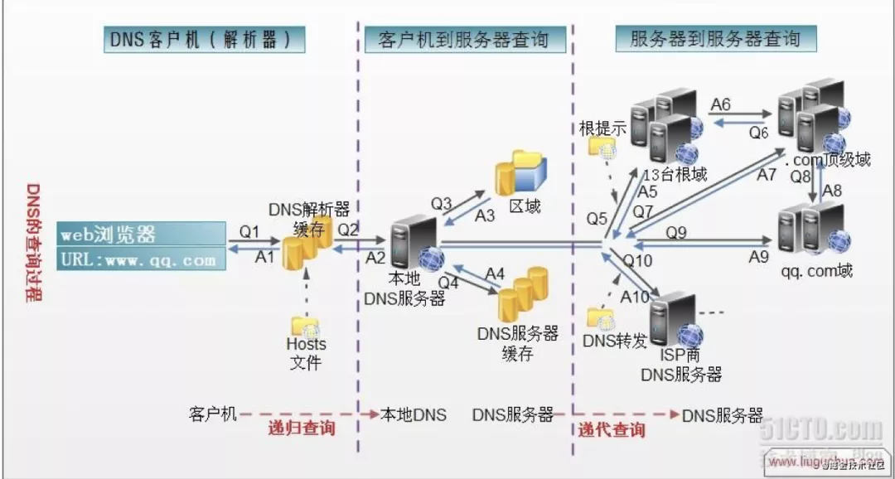

# CDN

> - CDN ( Content Delivery Network ): 内容分发网络
>   - 在构建在现有的互联网基础之上的一层的智能虚拟网络, 通过咋网络各处部署节点服务器, 实现将资源站内容分发至所有的CDN节点, 是用户可以就近获得所需的内容.
>   - CDN工作原理: 将全球各地的CDN节点上, 用户请求资源时, 就近返回节点的资源, 而不需要每个用户的请求都回您的源站获取, 避免网络拥塞, 缓解源站压力, 提交用户体验
> - 以前是通过IP来互相访问, IP不好记, 便有了域名.
> - 常见的DNS解析服务商有：阿里云解析，万网解析，DNSPod，新网解析，Route53（AWS），Dyn，Cloudflare等。
> - TLD: 顶级域名
> - 优点:
>   - 减低延迟, 提高访问网站速度
>   - 缓解源站压力
>   - 缓解骨干网的压力
>   - 优化网上热点内容
>     - eg: 热点内容的服务器都在北京，如果我想获取热点内容，我就需要发送请求到北京的服务器，但若有了cdn，我只需要就近服务器获取热点内容，这样就分摊优化热点内容的分布了。

> - 浏览器域名解析过程( CDN加速前 )
> - 系统DNS缓存,hosts文件
> - 路由器DNS缓存
> - 本地DNS服务器,ISP运营服务提供者
> - 本地DNS服务器, 请求根域名服务器,13个,不是只有13台服务器, 拿到DNS记录
> - 本地DNS服务器拿到顶级域名域名服务器ip, 就去请求顶级域名服务器
> - 本地DNS服务器工具拿到的耳机域名服务器的ip, 就去请求二级域名服务器
> - 直到X级域名服务器返回我们目标域名对应的ip地址后, 本地DNS服务器缓存该DNS记录, 然后返回路由器
> - 客户端拿到ip地址, 利用该ip地址, 封装并发起http/http2请求
> - 前面四步是递归查询, 一单缓存可用, 就可直接返回, 不会在进行后续步骤, 后面迭代查询, 最终获取ip地址, 才会返回

## CDN节点缓存策略

> - CDN通过在现有网络中增加一层新的缓存节点，将源站的资源发布到最接近用户的网络节点，使得客户端在请求时直接访问到就近的CDN节点并命中该资源，减少回源情况，提高网站访问速度。
> - cdn缓存服务器还会根据不同运营商做区分，因为跨运营商需要在交换点进行转换，如果同个运营商则不需要转换，尽量会选择同一运营商的cdn缓存服务器来获取数据或回源。
> - CDN缓存一般分3层，客户端、CDN Cache L1、CDN Cache L2，当然也可以只有2层。

## CDN工作原理
