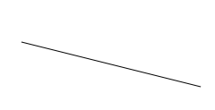
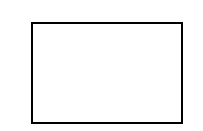
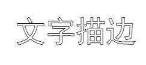

# stroke\_

## stroke

> 对路径进行描边

```js
context.stroke()
context.stroke(path)
```

参数 `pathObject` :指Path2D对象(IE浏览器不支持)

```js
context.moveTo(50, 50)
context.lineTo(250, 100)
// 描边
context.stroke()
```



## strokeRect

> 矩形描边

```js
context.strokeRect(x, y, width, height)
```

| 参数   | 类型   | 作用             |
| :----- | :----- | :--------------- |
| x      | Number | 矩形的起点横坐标 |
| y      | Number | 矩形的起点纵坐标 |
| width  | Number | 矩形的宽度       |
| height | Number | 矩形的高度       |

```js
// 像素宽矩形描边
context.lineWidth = 2
context.strokeRect(75, 25, 150, 100)
```



## strokeText

> 文字描边, 居中描边

```js
context.strokeText(text, x, y [, maxWidth]);
```

| 参数     | 类型                        | 参数                                                  |
| :------- | :-------------------------- | :---------------------------------------------------- |
| text     | String 用来描边的文本信息。 |
| x        | Number                      | 描边文本的起点横坐标。                                |
| y        | Number                      | 描边文本的起点纵坐标。                                |
| maxWidth | （可选）Number              | 填充文本最大宽度 (超过最大宽度, 通过压缩每个文本宽度) |

```js
// 文字描边
context.font = '50px STHeiti, SimHei'
context.strokeText('文字描边', 50, 90)
```


