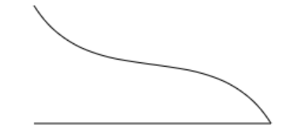
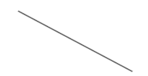

# 路径

## beginPath 新路径

> `beginPath` > `type: ()=>void`
> 新的路径, 和之前的路径分开

```js
// 开始路径
context.beginPath()
context.strokeStyle = 'blue'
context.moveTo(60, 20)
context.lineTo(220, 20)
context.stroke()
// 开始路径 again
context.beginPath()
context.strokeStyle = 'green'
context.moveTo(60, 20)
context.lineTo(160, 120)
context.stroke()
```


> 执行两次`beginPath()`

## closePath 闭合路径

> `closePath()` > `type: ()=> void`
> 关闭该路径 将绘制指令重新转移到上下文

```js
// 绘制三角
context.beginPath()
context.moveTo(10, 10)
context.lineTo(140, 70)
context.lineTo(70, 140)
// 不执行闭合，直接描边
context.stroke()

// 绘制另外一个三角
context.beginPath()
context.moveTo(160, 10)
context.lineTo(290, 70)
context.lineTo(220, 140)
// 执行闭合，然后描边
context.closePath()
context.stroke()
```


> 左侧图形没有执行`closePath()`，右侧执行了`closePath()`

## fill 路径填充

> 路径填充, 包含非零规则, 奇偶规则

```js
context.fill()
context.fill(fillRule)
context.fill(path, fillRule)
```

> `fillRule { String }`: 填充规则。用来确定一个点实在路径内还是路径外。可选值包括：
>
> - `nonzero`：非零规则，此乃默认规则
> - `evenodd`：奇偶规则
>
> `path { Object }`: 指Path2D对象

```html
<canvas width="300" height="300" data-rule="nonzero"></canvas>
<canvas width="300" height="300" data-rule="evenodd"></canvas>
```

```js
// 2个三角的点坐标
var arrPoints = [
  [60, 60],
  [240, 100],
  [160, 280],
  [60, 60],
  [150, 20],
  [260, 260],
]
var canvases = document.querySelectorAll('canvas')
// 遍历
;[].slice.call(canvases).forEach(function (canvas, index) {
  var rule = canvas.getAttribute('data-rule')
  var context = canvas.getContext('2d')
  // 开始绘制
  context.beginPath()
  context.moveTo(arrPoints[0][0], arrPoints[0][1])
  context.lineTo(arrPoints[1][0], arrPoints[1][1])
  context.lineTo(arrPoints[2][0], arrPoints[2][1])
  context.lineTo(arrPoints[3][0], arrPoints[3][1])
  context.lineTo(arrPoints[4][0], arrPoints[4][1])
  context.lineTo(arrPoints[5][0], arrPoints[5][1])
  context.closePath()
  context.fillStyle = '#0e65c5'
  context.fill(rule)
})
```


## lineTo 连接

> 绘制直线连接最后的子路径点喝lineTo()指定点

`context.lineTo(x, y)`
| 参数 | 类型 | 作用 |
| :--- | :------- | :----------------------- |
| `x` | `Number` | 绘制的直线的落点的横坐标 |
| `y` | `Number` | 绘制的直线的落点的纵坐标 |

```js
context.beginPath()
context.moveTo(50, 20)
context.bezierCurveTo(100, 100, 200, 40, 250, 120)
context.lineTo(50, 120)
context.stroke()
```



## moveTo 绘制点移动

### 　`context.moveTo(x, y);`

| 参数 | 类型     | 作用         |
| :--- | :------- | :----------- |
| `x`  | `Number` | 落点的横坐标 |
| `y`  | `Number` | 落点的纵坐标 |

```js
context.beginPath()
context.moveTo(50, 20)
context.lineTo(200, 100)
context.stroke()
```



## drawFocusIfNeeded 路径高亮

> 路径处于focus状态
> 兼容性差
> 增强可访问性
> 日常使用:
>
> - 用来增强高亮复杂路径
> - 点选删除元素
> - 复制移动工具类应用场景

```js
context.drawFocusIfNeeded(element)
context.drawFocusIfNeeded(path, element)
```

> `element { Object }` 用来检测当前是否处于focus状态的元素。此元素需要原本就是可聚焦的元素，例如按钮或者链接或者输入框等。然后，还需要放置在`<canvas>`标签中才有用
> `path { Object }` 指Path2D对象

```html
<canvas id="canvas" width="240" height="120">
  <button id="button1">按钮1</button>
  <button id="button2">按钮2</button>
</canvas>
```

```js
// 两个按钮元素
var button1 = document.getElementById('button1')
var button2 = document.getElementById('button2')
// canvas元素和上下文
var canvas = document.querySelector('#canvas')
var context = canvas.getContext('2d')
var draw = function () {
  context.clearRect(0, 0, 240, 120)
  // 设置字体样式
  context.font = '16px STHeiti, SimHei'
  context.textAlign = 'center'
  context.textBaseline = 'middle'
  // 绘制两个圆和文字
  context.beginPath()
  context.arc(60, 60, 50, 0, Math.PI * 2)
  context.fillStyle = 'red'
  context.fill()
  context.fillStyle = 'white'
  context.fillText('按钮1', 60, 60)
  context.drawFocusIfNeeded(button1)

  context.beginPath()
  context.arc(180, 60, 50, 0, Math.PI * 2)
  context.fillStyle = 'green'
  context.fill()
  context.fillStyle = 'white'
  context.fillText('按钮2', 180, 60)
  context.drawFocusIfNeeded(button2)
}
draw()

// 点击canvas元素
canvas.addEventListener('click', function (event) {
  // 通过点击位置判断点击是哪个圈圈
  var x = event.clientX - canvas.getBoundingClientRect().left
  var y = event.clientY - canvas.getBoundingClientRect().top
  // 距离两个圈圈圆心的距离
  var distance1 = Math.sqrt((60 - x) * (60 - x) + (60 - y) * (60 - y))
  var distance2 = Math.sqrt((180 - x) * (180 - x) + (60 - y) * (60 - y))
  // 根据距离和半径大小判断是否在圈内
  if (distance1 <= 50) {
    button1.focus()
    draw()
  } else if (distance2 < 50) {
    button2.focus()
    draw()
  }
})
```


```js
beginPath() //新建一条路径一旦创建成功 绘制命令将转移到新建的路径上
moveTo(x, y) // 移动画笔到(x , y) 点开始后面的绘制工作
closePath() // 关闭该路径 将绘制指令重新转移到上下文
stroke() // 将绘制的路径进行描边
fill() // 将绘制的封闭区域进行填充
```
