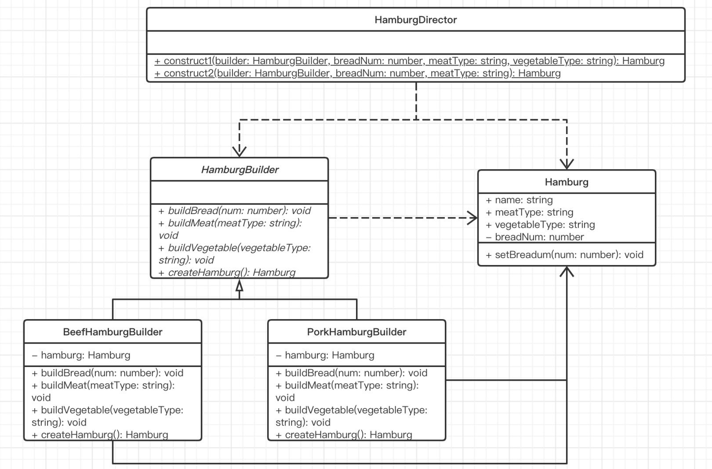

# 建造者(创建者)模式

> 工厂模式:
>
> - 为我们将客户端的生产行为封装起来，交给了工厂。
> - 它本质上是服务于客户端的，并没有降低产品生产的难度，产品的生产逻辑仍然在自己的类内部实现。
> - 对于一些复杂的产品类（工序多，参数多），我们需要在内部维护其复杂的构建逻辑，是很容易出错的。
>   - 举一个简单的例子，生产牛肉汉堡，我们不管是由客户端去生产，还是工厂帮我们生产，建造的逻辑始终写在其 constructor 内部。
>   - 全部生产步骤可能包含，做面包，做牛肉，放蔬菜，每个步骤可能有不同的参数控制，比如几片面包，几片牛肉或者几片蔬菜。如果我们发现之前的工序不好，需要调整工序，要么在类内部进行修改（违法开闭），要么新增一个类（成本太大，也不好维护），或者说我们要做猪肉汉堡，步骤和工序是一样的，我们新建一个类时由于步骤复杂，可能漏了或写错了。
>
> 建造者模式
>
> - 也叫创建者模式，它将一个复杂对象的构建与它的表示分离，使得同样的构建过程可以创建不同的表示
> - 创建一个复杂对象的，它将一个复杂的对象的构建与它的表示分离，使得同样的构建过程可以创建不同的表示。
> - 比如我规定汉堡的构建工序是可以稳定地划分为，做面包，做肉，放蔬菜的，至于你具体是面包是做成方形的圆形的，肉要是什么类型，蔬菜是什么类型，这是具体的实现步骤，对不同的汉堡具体的实现不一样。

## 建造者模式



> 这里抽象建造者使用接口也是 okay 的。可以看到这里不管抽象的建造者还是具体的建造者依赖（关联）的都是 Hamburg，这个 Hamburg 其实也可以是一个父类或者抽象类。

```ts
class Hamburg {
  name: string
  // 可选参数也可以使用 set，但是 ts 中直接在这里声明更方便, 当然如果是 private，需要使用 set 来封装
  meatType?: string
  vegetableType?: string
  private breadNum?: number

  constructor(name: string) {
    // 如果我们不用建造者模式，那么产品类的 constructor 这里将要传入所有参数
    this.name = name // 必选参数可以放在这里，步骤具体实现可变的就抽出来
  }

  // 利用 ts 的 set 当然也是 okay 的，比如 set num(num){ this.breadNum = num; }
  setBreadNum(num: number) {
    this.breadNum = num
  }
}

// 原本放在产品类的构建步骤被转移到了建造者类，由具体的建造者实现
abstract class HamburgBuilder {
  abstract buildBread(breadNum: number): void
  abstract buildMeat(meatType: string): void
  abstract buildVegetable(vegetableTYpe: string): void
  abstract createHamburg(): Hamburg
}

class BeefHamburgBuilder extends HamburgBuilder {
  // 这里如果可以确定 name，就不需要用户再传入了
  private hamburg: Hamburg = new Hamburg('牛肉汉堡')

  buildBread(breadNum: number): void {
    console.log(`制作牛肉汉堡需要的 ${breadNum} 片面包`)
    this.hamburg.setBreadNum(breadNum)
  }

  buildMeat(meatType: string): void {
    console.log(`制作牛肉汉堡需要的 ${meatType}`)
    this.hamburg.meatType = meatType
  }

  buildVegetable(vegetableType: string): void {
    console.log(`制作牛肉汉堡需要的 ${vegetableType}`)
    this.hamburg.vegetableType = vegetableType
  }

  createHamburg(): Hamburg {
    return this.hamburg
  }
}

class PorkHamburgBuilder extends HamburgBuilder {
  private hamburg: Hamburg = new Hamburg('猪肉汉堡')

  buildBread(breadNum: number): void {
    console.log(`制作猪肉汉堡需要的 ${breadNum} 片面包`)
    this.hamburg.setBreadNum(breadNum)
  }

  buildMeat(meatType: string): void {
    console.log(`制作猪肉汉堡需要的 ${meatType}`)
    this.hamburg.meatType = meatType
  }

  buildVegetable(vegetableType: string): void {
    console.log(`制作猪肉汉堡需要的 ${vegetableType}`)
    this.hamburg.vegetableType = vegetableType
  }

  createHamburg(): Hamburg {
    return this.hamburg
  }
}

// 我们用 director 来封装顺序，如果要改变工序，只要新增一个 director 或者新增一个 construct 即可
class HamburgDirector {
  // 顺序1，包含三道工序
  static construct1(
    builder: HamburgBuilder,
    breadNum: number,
    meatType: string,
    vegetableType: string,
  ): Hamburg {
    builder.buildBread(breadNum)
    builder.buildMeat(meatType)
    builder.buildVegetable(vegetableType)
    return builder.createHamburg()
  }

  // 顺序2，包含两道工序
  static construct2(
    builder: HamburgBuilder,
    breadNum: number,
    meatType: string,
  ): Hamburg {
    builder.buildMeat(meatType)
    builder.buildBread(breadNum)
    return builder.createHamburg()
  }
}

const beefHamburgBuilder = new BeefHamburgBuilder()
const porkHamburgBuilder = new PorkHamburgBuilder()

HamburgDirector.construct1(beefHamburgBuilder, 2, 'beef', 'carrot')
HamburgDirector.construct2(porkHamburgBuilder, 3, 'pork')
```

## 小结

> - 建造者模式的核心其实就是将具体的建造过程提取出来，进行封装。构建步骤封装在建造者，构建顺序封装在导演类。
> - 可以一个导演类对应于一个建造者，也可以对应对个建造者，甚至你如果不用导演类，由客户端来选择构建顺序也是 okay 的。
