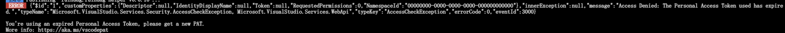
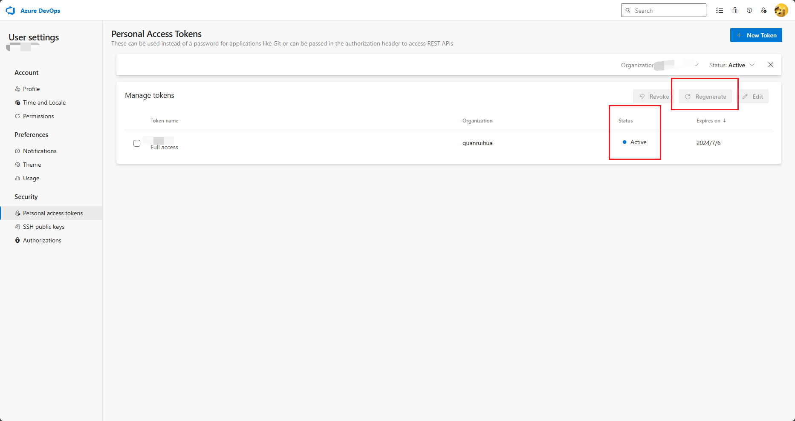

# 兼容性

## Personal Access Tokens 过期

```shell
ERROR  {"$id":"1","customProperties":{"Descriptor":null,"IdentityDisplayName":null,"Token":null,"RequestedPermissions":0,"NamespaceId":"00000000-0000-0000-0000-000000000000"},"innerException":null,"message":"Access Denied: The Personal Access Token used has expired.","typeName":"Microsoft.VisualStudio.Services.Security.AccessCheckException, Microsoft.VisualStudio.Services.WebApi","typeKey":"AccessCheckException","errorCode":0,"eventId":3000}

You're using an expired Personal Access Token, please get a new PAT.
More info: <https://aka.ms/vscodepat>
```



- 解决: 去 <https://dev.azure.com/>
  

- 查看Status 是否过期, 过期则通过 Regenerate 修改过期时间
- 再次发布即可

## `pnpm` 与 `vsce` 不兼容

- 切换为 `yarn`, 重新安装依赖
- 使用的命令后面添加 `--no-yarn`, 及可以正常发布和打包
